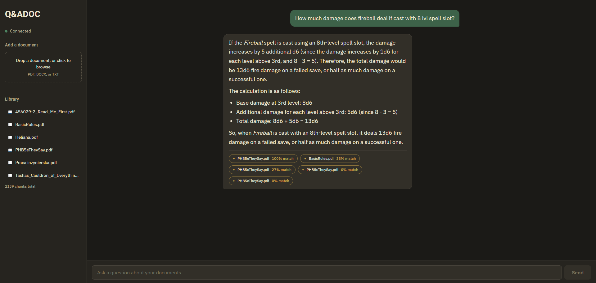
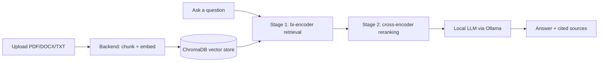

# 📄 Q&ADOC

Ask questions about your own documents and get answers grounded in them, not guessed from thin air.

> Upload a PDF/DOCX/TXT → it gets chunked and indexed → ask a question in plain English → a local LLM answers using only what's actually in your documents, and tells you which sources it used.

---

## ✨ Features

- **Local, private RAG pipeline** — documents, embeddings, and answers never leave your machine; answer generation runs through [Ollama](https://ollama.com/)
- **Two-stage retrieval** — a fast bi-encoder (`all-MiniLM-L6-v2`) pulls a broad set of candidates from ChromaDB, then a cross-encoder reranker picks the best matches to actually hand to the LLM
- **Fine-tunable reranker** — comes with training code to fine-tune the reranker on your own (question, chunk, label) data, plus an Optuna-based hyperparameter search to find good training settings automatically
- **Multi-format ingestion** — PDF, DOCX, and TXT supported out of the box, chunked with overlap so context isn't lost at chunk boundaries
- **Incremental indexing** — upload documents one at a time; each one is appended to the existing index instead of replacing it
- **Grounded, source-cited answers** — the LLM is instructed to answer only from retrieved context and to say so explicitly if it can't, with relevance scores returned per source
- **Web-based UI** — upload documents and ask questions from a React frontend talking to a FastAPI backend

## 🧠 How it works



1. You upload a document; it's parsed, split into overlapping chunks, and embedded into a local ChromaDB collection.
2. You ask a question in the web UI.
3. **Stage 1:** a bi-encoder (`all-MiniLM-L6-v2`) retrieves a broad set of candidate chunks from ChromaDB.
4. **Stage 2:** a cross-encoder reranker — the fine-tuned one if you've trained it, otherwise a solid base model — re-scores those candidates and keeps only the best.
5. The top chunks are handed to a local LLM through Ollama, which is instructed to answer only from that context and cite its sources.
6. You get an answer plus a list of the sources and relevance scores behind it.

## 🛠 Tech stack

- **Backend:** Python, FastAPI, ChromaDB
- **LLM inference:** [Ollama](https://ollama.com/), running locally (`qwen2.5:14b` by default)
- **Model training:** PyTorch, sentence-transformers, Optuna for hyperparameter search
- **Frontend:** React + Vite

## 🚧 Status

This project is a **work in progress**, but the core upload → index → retrieve → answer loop works end-to-end, including the fine-tuning and hyperparameter-search tooling for the reranker. I'll be working on making it more non-tech user friendly, UX and chat memory next.

Notes:
- Requires [Ollama](https://ollama.com/) running locally on port `11434` with your chosen model pulled — the backend doesn't manage or start it for you.
- The fine-tuned reranker is optional: until you run training, the app falls back to the base `cross-encoder/ms-marco-MiniLM-L-6-v2` model automatically.
- GPU acceleration (CUDA) is expected for training/inference at reasonable speed, but isn't a hard requirement.

## 🚀 Getting started

Requirements:
- Python 3.10+
- Node.js (for the frontend, via `npm`)
- [Ollama](https://ollama.com/) installed, running, and with an answer model pulled (default: `qwen2.5:14b` — see `app/rag.py` to change it)

Setup:

```bash
git clone https://github.com/Layrixi/Q-ADOC.git
cd Q-ADOC
python -m venv .venv
.venv\Scripts\activate      # or: source .venv/bin/activate on Linux/macOS
pip install -r requirements.txt
cd frontend-react
npm install
cd ..
```

Make sure Ollama is running (`ollama serve`, or it's already running as a service) before starting the app.

Run backend + frontend together:

```bash
python run_dev.py
```

Or on Windows, just double-click `run_dev.bat`. Remember to change the venv if you're using a custom name.

Then open `http://localhost:5173` in your browser. The API itself runs on `http://localhost:8000`.

## 🎯 Fine-tuning the reranker (optional)

The base reranker works out of the box, but you can fine-tune it on your own labeled (question, chunk, label) data for better retrieval quality on your documents:

```bash
python -m app.train_reranker --smoke_test   # quick sanity check on a small subset
python -m app.train_reranker                # full training run
```

To search for good training hyperparameters first:

```bash
python -m app.optuna_search
```

The fine-tuned model is saved to `models/reranker-finetuned/` and picked up automatically the next time the backend starts.
